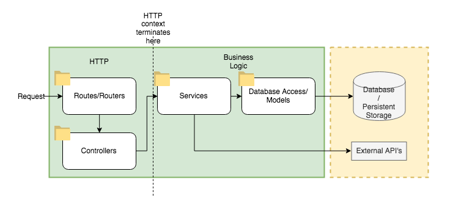

# edgecraft-api
> **[참고자료]**
> https://github.com/create-go-app/fiber-go-template
> https://github.com/golang-standards/project-layout
> https://gofiber.io/

&nbsp;<a href="https://goreportcard.com/report/github.com/create-go-app/fiber-go-template" target="_blank"></a>&nbsp;

## 구성 요소
- golang `1.18`
- fiber `2.34` - web framework
- 
-----
## 📦 Used packages

| Name                                                                  | Version    | Type       |
| --------------------------------------------------------------------- | ---------- | ---------- |
| [gofiber/fiber](https://github.com/gofiber/fiber)                     | `v2.34.0`  | core       |
| [gofiber/jwt](https://github.com/gofiber/jwt)                         | `v2.2.7`   | middleware |
| [arsmn/fiber-swagger](https://github.com/arsmn/fiber-swagger)         | `v2.31.1`  | middleware |
| [stretchr/testify](https://github.com/stretchr/testify)               | `v1.7.1`   | tests      |
| [golang-jwt/jwt](https://github.com/golang-jwt/jwt)                   | `v4.4.1`   | auth       |
| [joho/godotenv](https://github.com/joho/godotenv)                     | `v1.4.0`   | config     |
| [jmoiron/sqlx](https://github.com/jmoiron/sqlx)                       | `v1.3.5`   | database   |
| [jackc/pgx](https://github.com/jackc/pgx)                             | `v4.16.1`  | database   |
| [go-sql-driver/mysql](https://github.com/go-sql-driver/mysql)         | `v1.6.0`   | database   |
| [gorm.io/gorm](https://github.com/go-gorm/gorm)                       | `v1.23.6`  | database   |
| [go-redis/redis](https://github.com/go-redis/redis)                   | `v8.11.5`  | cache      |
| [swaggo/swag](https://github.com/swaggo/swag)                         | `v1.8.2`   | utils      |
| [google/uuid](https://github.com/google/uuid)                         | `v1.3.0`   | utils      |
| [go-playground/validator](https://github.com/go-playground/validator) | `v10.10.0` | utils      |


## Project workflow  

-----
## 🗄 Directory structure

### ./api
**Folder with OpenAPI/Swagger 스펙들.**

### ./cmd
**Main applications for this project.**

### ./internal
**Private application and library code.**. This is the code you don't want others importing in their applications or libraries.

- `./internal/cache` folder with in-memory cache setup functions (by default, Redis)
- `./internal/database` folder with database setup functions (by default, PostgreSQL)
- `./internal/controllers` folder for functional controllers (used in routes)
- `./internal/entites` folder for describe business models and methods of your project
- `./internal/service` folder for describe queries for models of your project
- `./internal/routes` folder for describe routes of your project


### ./pkg

**Library code that's ok to use by external applications.**. This directory contains all the project-specific code tailored only for your business use case, like _configs_, _middleware_, _routes_ or _utils_.

- `./pkg/configs` folder for configuration functions
- `./pkg/middleware` folder for add middleware (Fiber built-in and yours)
- `./pkg/repository` folder for describe `const` of your project
- `./pkg/utils` folder with utility functions (server starter, error checker, etc)

### ./docs

**Folder with 사용자 문서들.**

### ./scripts
**빌드, 설치, 분석, 기타 작업을 위한 스크립트들.**

-----
## ⚡️ Quick start

1. Rename `.env.example` to `.env` and fill it with your environment values.

2. Install [Docker](https://www.docker.com/get-started) and the following useful Go tools to your system:
   - [golang-migrate/migrate](https://github.com/golang-migrate/migrate#cli-usage) for apply migrations
   - [github.com/swaggo/swag](https://github.com/swaggo/swag) for auto-generating Swagger API docs
   - [github.com/securego/gosec](https://github.com/securego/gosec) for checking Go security issues
   - [github.com/go-critic/go-critic](https://github.com/go-critic/go-critic) for checking Go the best practice issues
   - [github.com/golangci/golangci-lint](https://github.com/golangci/golangci-lint) for checking Go linter issues

3. Run project by this command:
```bash
make docker.run
```
