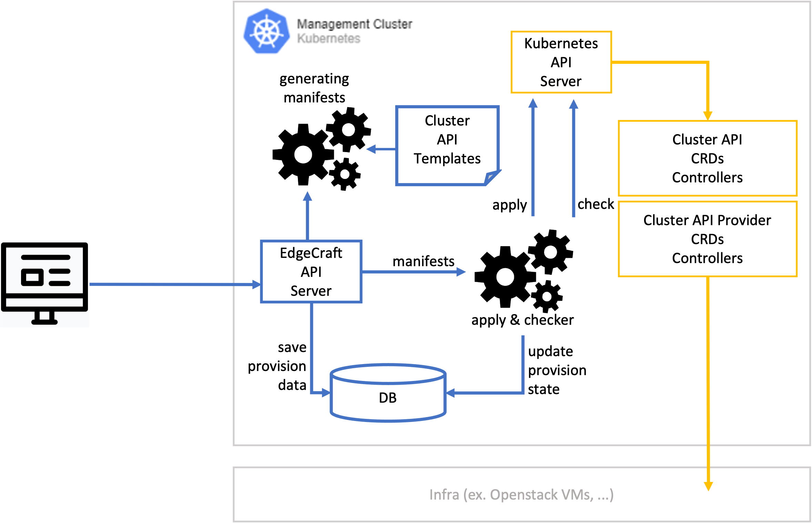

# Edgecreaft API Server

&nbsp;&nbsp;

## 구성요소
- golang `v1.18`
- echo `v4.72`
- gorp `v2.2.0`
- viper `v1.12.0`

-----
## 🗄 Directory structure
### ./cmd
**Main applications for this project.**

### ./conf
**Folder with configuration files and response message guide files.**

### ./docs
**Folder with 사용자 문서들. and Swagger 스펙들.**

### ./pkg
**Library code that's ok to use by applications.**. This directory contains all the project-specific code tailored only for your business use case, like _configs_, _middleware_, _routes_ or _utils_.
- `./pkg/api` folder for functional controllers (used in route)
- `./pkg/common` folder for common functions
- `./pkg/config` folder for configuration functions
- `./pkg/db` folder for service functions - queries for models and business logic
- `./pkg/logger` folder for logger functions
- `./pkg/middleware` folder for add middleware
- `./pkg/model` folder for describe business models and methods of your project - service entites
- `./pkg/route` folder for describe routes of your project
- `./pkg/server` folder for web framework functions
- `./pkg/utils` folder with utility functions (error checker, etc)

### ./scripts
**빌드, 설치, 분석, 기타 작업을 위한 스크립트들.**

-----
## Project workflow  

## Cluster API Workflow

