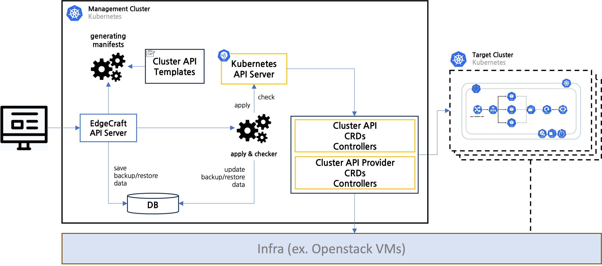

# Edgecraft Architecture

잘 갖춰진 클라우드의 이용은 쉽지만, 정작 클라우드 구축은 복잡하고 도전적인 과정일 수 있습니다. 이를 다순화 하고 Cluster API를 사용해서 쿠버네티스 클러스터의 Lifecycle을 관리 할 수 있다. 또한 쿠버네티스의 클러스터의 Backup/Restore를 관리하고, CIS Benchmarks를 자동화 검증하여 클러스터의 보안 규정을 준수 할 수 있도록 가이드를 제공하고 있다.

- Edgecraft Workflow

 

## What is Kubernetes?

Kubernetes는 컨테이너 오케스트레이션 플랫폼으로, 컨테이너화된 응용 프로그램을 관리하고 배포하는 오픈 소스 플랫폼입니다. Kubernetes는 Google에서 개발한 초기 프로젝트인 Borg를 기반으로 만들어졌으며, 컨테이너 관리, 스케일링, 자가 치유, 로드 밸런싱 등을 자동화하는 데 사용됩니다.

### Kubernetes 클러스터를 구축하는 어렵다?
Kubernetes 클러스터를 구축하는 것은 복잡하고 도전적인 과정일 수 있습니다. 이것은 여러 이유로 어렵게 느껴질 수 있습니다

- **다양한 구성 옵션**: Kubernetes 클러스터를 구축할 때 사용할 수 있는 다양한 옵션이 있습니다. 클라우드 환경, 온프레미스 환경 또는 혼합 환경에서 Kubernetes를 구축할 수 있으며, 각각의 환경에 따라 구성 옵션과 요구 사항이 다릅니다.

- **많은 컴포넌트**: Kubernetes는 여러 컴포넌트로 구성되어 있으며, 각 컴포넌트는 별도로 구성하고 관리해야 합니다. 예를 들어, 마스터 노드, 워커 노드, 네트워킹, 스토리지, 로깅 및 모니터링 등 다양한 측면을 다루어야 합니다.

- **네트워킹**: Kubernetes 클러스터에서 네트워킹을 설정하고 관리하는 것은 어려울 수 있습니다. 컨테이너와 서비스 간의 통신, 로드 밸런싱, 클러스터 내 DNS 설정 등이 필요합니다.

- **설정 및 구성 관리**: Kubernetes 클러스터의 설정과 구성은 복잡하고 오류를 발생시키기 쉽습니다. 올바른 설정을 유지하고 업데이트하려면 신경을 많이 써야 합니다.

- **시작 단계와 배포**: 클러스터를 처음부터 시작하거나 기존 클러스터를 확장하려면 이러한 프로세스를 이해하고 실행해야 합니다.

- **보안 및 권한 관리**: Kubernetes는 보안과 권한 관리가 중요한 요소입니다. 올바른 보안 설정 및 RBAC(Role-Based Access Control) 정책을 적용해야 합니다.

- **유지 및 관리**: Kubernetes 클러스터를 운영하고 유지 관리하는 것 또한 어려울 수 있습니다. 애플리케이션의 로깅, 모니터링 및 백업을 설정하고 필요에 따라 업그레이드 및 확장해야 합니다.

- **생태계의 빠른 변화**: Kubernetes의 생태계는 계속해서 발전하고 변화하며, 새로운 도구, 기술 및 업데이트가 빠르게 나옵니다. 이로 인해 최신 정보를 학습하고 따라가는 것이 어려울 수 있습니다.

## What is Cluster API?

Cluster API는 Kubernetes 클러스터 관리를 자동화하기 위한 오픈 소스 프로젝트입니다. Kubernetes는 컨테이너 오케스트레이션 플랫폼으로, 어플리케이션을 배포하고 관리하기 위한 강력한 도구입니다. 그러나 Kubernetes 클러스터를 설정하고 관리하는 것은 복잡하고 번거로운 작업일 수 있습니다. Cluster API는 이러한 복잡성을 줄이고 Kubernetes 클러스터를 쉽게 생성, 업데이트 및 관리할 수 있도록 설계되었습니다.