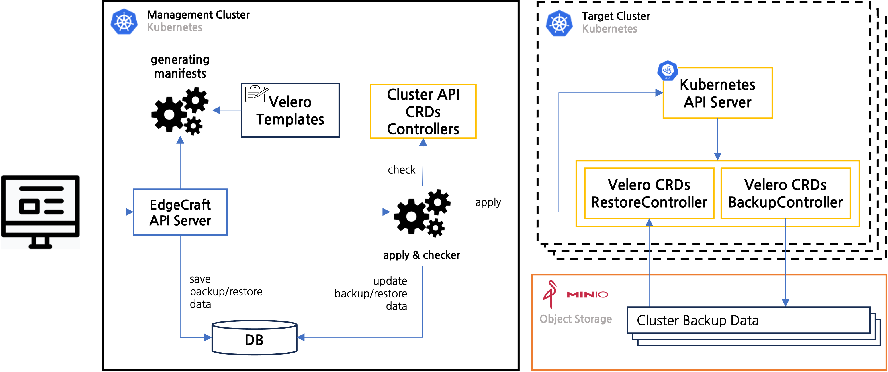

# 클라우드 Backup and Restore

클라우드의 구축 이후 장애 또는 점검을 위해 백업/복구 되어야 한다. Edgecraft는 구축된 클라우드의 백업 및 복원을 Velero를 사용하여 멀티 클러스터의 Kubernetes 환경에서 신속하고 안정적인 백업 및 복원 프로세스를 구축하고 실행할 수 있습니다.

- Edgecraft Backup and Restore Workflow

### Requirements

- Minio Object Storage