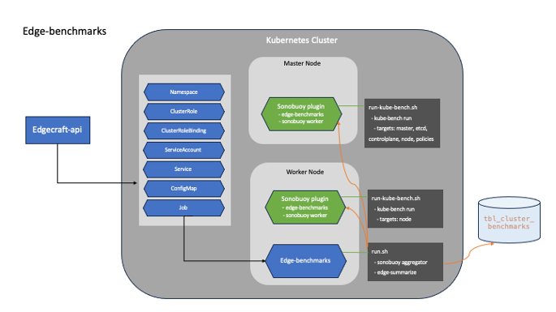

# CIS Benchmarks 검증 자동화

CIS Benchmarks (Center for Internet Security Benchmarks)은 컴퓨터 시스템 및 네트워크 보안을 개선하기 위한 안전한 구성 및 관리 가이드라인의 모음입니다. CIS는 미국의 비영리 단체로, 정보 보안 및 사이버 위협에 대한 모범 사례와 안전한 환경을 구축하는 데 도움이 되는 보안 지침을 개발 및 제공하고 있습니다. CIS Benchmarks는 기업 및 조직이 정보 시스템을 보호하고 공격에 대비하기 위해 사용하는 중요한 도구 중 하나입니다.

각 CIS 벤치마크에는 권장 사항에 대한 설명, 권장 사항의 이유 및 시스템 관리자가 권장 사항을 올바르게 구현하기 위해 따를 수 있는 지침이 포함되어 있습니다.
각 벤치마크는 대상 IT 시스템의 각 영역을 다루기 때문에 수백 페이지에 이를 수 있습니다. 이런 CIS 벤치마크를 구현하고 모든 버전 릴리스를 관리하는 작업은 수동으로 수행하기에 너무 복잡합니다.

이러한 문제점을 해소 하는 방안으로 엣지 클라우드 무결성(보안, 안정성) 검증 자동화 시스템을 사용하여 CIS 규정 준수를 모니터링 할 수 있습니다. 엣지 클라우드 무결성(보안, 안정성) 자동화 검증 시스템은 KaaS 지원 유형(kubeadm, k3s, microk8s)을 지원 합니다.

- Edge-benchmarks Workflow

